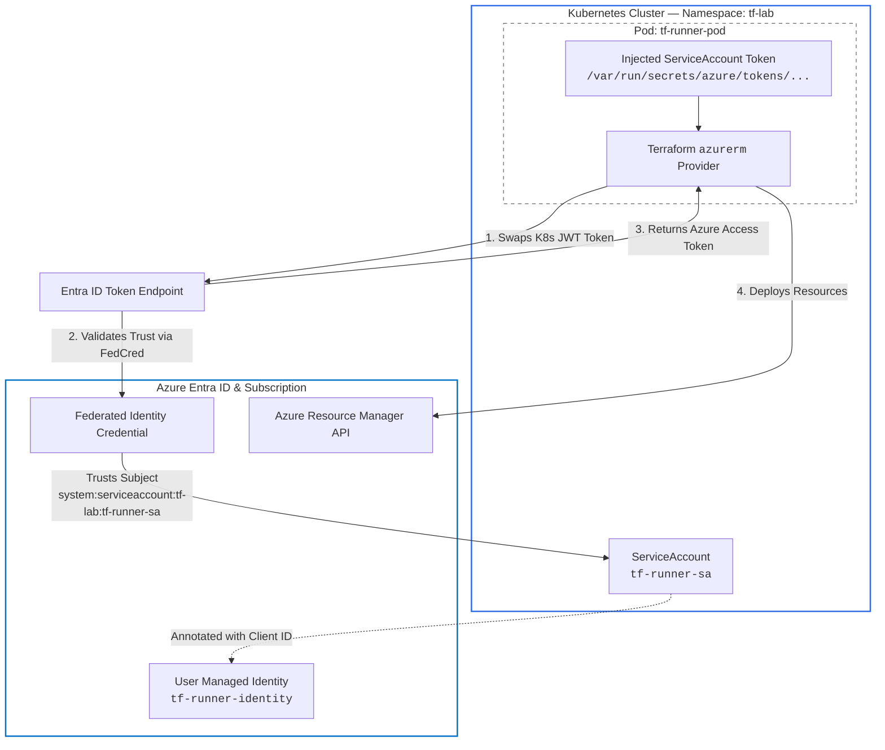

# Definitive guide for deploying Terraform on AKS using secretless Azure Workload Identity authentication.


In this guide, we are going to build a completely **secretless Terraform pipeline directly inside an Azure Kubernetes Service (AKS) cluster**. By leveraging Azure Workload Identity and Kubernetes Service Accounts, your pod will automatically authenticate with Azure Entra ID using short-lived OIDC tokens. Say goodbye to hardcoded client secrets, expired passwords, and credential leaks—by the time you finish this guide, you'll have a clean, production-ready prototype environment that deploys Azure infrastructure safely and seamlessly.

---

### What We’ll Cover

* **Architecture Overview:** How OIDC, AKS, and Azure Entra ID talk to each other without static secrets.
* **Prerequisites & Azure Setup:** Configuring the Managed Identity, OIDC Issuer, and Federated Credentials.
* **Kubernetes Manifests:** Setting up the dedicated ServiceAccount and Pod manifest with proper volume mounts.
* **Terraform Configuration:** Configuring the `azurerm` provider to handle OIDC authentication smoothly.
* **Execution & Verification:** Testing your secretless pipeline with `terraform init` and `terraform plan`.
* **Troubleshooting Cheat Sheet:** Quick fixes for common environment variable and provider authorization pitfalls.

## Architectural Overview


The system relies on three layers working in sync:

1. **AKS Cluster:** Acts as an OIDC Identity Provider (IdP).
2. **Azure Entra ID:** Trusts the AKS OIDC issuer via a Federated Identity Credential tied to a User-Assigned Managed Identity (UMI).
3. **Pod & Terraform:** The Mutating Webhook injects the JWT token; environment variables route that token to Terraform’s `azurerm` provider.




---

## Stage 1: Infrastructure Setup (One-Time Cluster & Identity Config)

### Step 1: Enable OIDC and Workload Identity on AKS

Ensure your cluster has both features active:

```bash
az aks update \
  --resource-group <CLUSTER_RG> \
  --name <CLUSTER_NAME> \
  --enable-oidc-issuer \
  --enable-workload-identity

```

Retrieve your cluster’s OIDC Issuer URL:

```bash
export AKS_OIDC_ISSUER=$(az aks show \
  --resource-group <CLUSTER_RG> \
  --name <CLUSTER_NAME> \
  --query "oidcIssuerProfile.issuerUrl" -o tsv)

```

### Step 2: Create User-Assigned Managed Identity & Assign Roles

```bash
# Create Identity
az identity create \
  --name tf-runner-identity \
  --resource-group <IDENTITY_RG> \
  --location <LOCATION>

export UMI_CLIENT_ID=$(az identity show \
  --name tf-runner-identity \
  --resource-group <IDENTITY_RG> \
  --query clientId -o tsv)

# Assign Contributor (or required scope) to the Subscription
az role assignment create \
  --assignee $UMI_CLIENT_ID \
  --role "Contributor" \
  --scope "/subscriptions/<YOUR_SUBSCRIPTION_ID>"

```

### Step 3: Establish Federated Identity Trust

Link the Kubernetes ServiceAccount (`namespace` + `name`) to the Azure Identity:

```bash
az identity federated-credential create \
  --name "tf-runner-federated-cred" \
  --identity-name tf-runner-identity \
  --resource-group <IDENTITY_RG> \
  --issuer "$AKS_OIDC_ISSUER" \
  --subject "system:serviceaccount:tf-lab:tf-runner-sa" \
  --audience "api://AzureADTokenExchange"

```

---

## 3. Kubernetes Manifests

### Step 1: ServiceAccount (`sa.yaml`)

The ServiceAccount must carry the annotation containing the Managed Identity Client ID.

```yaml
apiVersion: v1
kind: ServiceAccount
metadata:
  name: tf-runner-sa
  namespace: tf-lab
  annotations:
    azure.workload.identity/client-id: "<YOUR_UMI_CLIENT_ID>"

```

### Step 2: Pod Specification (`pod.yaml`)

To bridge the gap between AKS Webhook variables (`AZURE_*`) and Terraform provider expectation (`ARM_*`), declare explicit `ARM_*` mappings in the Pod spec.

Use `subPath` on mounted files to preserve write permissions in `/workspace` for `.terraform` binaries.

```yaml
apiVersion: v1
kind: Pod
metadata:
  name: tf-runner-pod
  namespace: tf-lab
  labels:
    azure.workload.identity/use: "true"
spec:
  serviceAccountName: tf-runner-sa
  containers:
    - name: tf-cli
      image: hashicorp/terraform:light
      command: ["sleep", "3600"]
      workingDir: /workspace
      env:
        # Terraform Auth Controls
        - name: ARM_USE_OIDC
          value: "true"
        - name: ARM_OIDC_TOKEN_FILE_PATH
          value: "/var/run/secrets/azure/tokens/azure-identity-token"
        - name: ARM_SUBSCRIPTION_ID
          value: "<YOUR_SUBSCRIPTION_ID>"
        
        # Explicit ARM Mappings for Provider Authorizer
        - name: ARM_CLIENT_ID
          value: "<YOUR_UMI_CLIENT_ID>"
        - name: ARM_TENANT_ID
          value: "<YOUR_TENANT_ID>"
      volumeMounts:
        - name: tf-code-vol
          mountPath: /workspace/main.tf
          subPath: main.tf
  volumes:
    - name: tf-code-vol
      configMap:
        name: tf-code

```

---

## 4. Terraform Configuration (`main.tf`)

Keep `main.tf` clean. Enable `use_oidc = true` in the provider configuration; Terraform will automatically digest the `ARM_*` variables supplied by the environment.

```hcl
terraform {
  required_version = ">= 1.0"
  required_providers {
    azurerm = {
      source  = "hashicorp/azurerm"
      version = "~> 3.0"
    }
  }
}

provider "azurerm" {
  features {}
  use_oidc = true
}

resource "azurerm_resource_group" "example" {
  name     = "rg-tf-workload-identity-demo"
  location = "eastus"
}

```

---

## 5. Execution & Verification Flow

Once deployed, execute commands directly inside the Pod container:

```bash
# 1. Inspect Mounted Token
cat /var/run/secrets/azure/tokens/azure-identity-token

# 2. Verify Environment Variables
env | grep -E 'ARM_|AZURE_'

# 3. Initialize Provider Dependencies
terraform init

# 4. Trigger OIDC Exchange and Plan Infrastructure
terraform plan

```

---

## 6. Troubleshooting Cheat Sheet

| Symptom | Root Cause | Fix |
| --- | --- | --- |
| `exec: "az": executable file not found` | The provider missing an `ARM_*` parameter (`ARM_SUBSCRIPTION_ID`, `ARM_CLIENT_ID`, `ARM_TENANT_ID`, or `ARM_OIDC_TOKEN_FILE_PATH`) and falling back to CLI lookup. | Ensure all 5 `ARM_*` environment variables are populated inside the Pod. |
| `Read-only file system` during `init` | Direct ConfigMap volume mount locking the entire workspace directory. | Mount `main.tf` using `subPath: main.tf` rather than mounting a directory. |
| `ARM_CLIENT_ID=$(AZURE_CLIENT_ID)` literal string | K8s environment variable expansion attempted before the Webhook injected `AZURE_*` keys. | Hardcode static string IDs in the Pod manifest `env` section instead of using `$(VAR)` syntax. |
| `AADSTS70021: No matching federated identity record` | Subject or Issuer mismatch between K8s ServiceAccount and Azure Federated Credential. | Verify `subject` in Azure matches `system:serviceaccount:<namespace>:<sa-name>` exactly. |